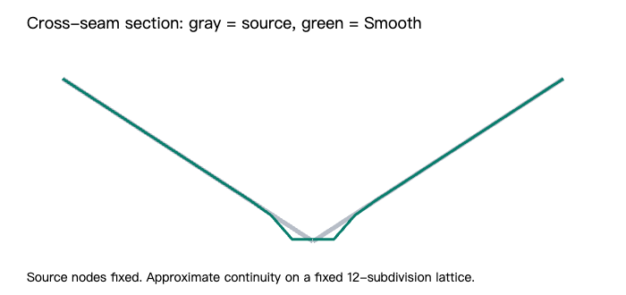

# V0.4.2 — Non-destructive Surface Smooth

本轮实现 `V0.4.1 Surface + minimum-energy displacement field`。源语义点、平面 Curve、控制柄、Patch Fullness、拓扑均不被求解器写回。

## 使用

展开侧边栏「曲面 Patch」，打开 **Surface Smooth**。**Smooth Strength** 调整完整修正场的应用比例，0% 精确恢复源曲面。选择恰好被两个 Patch 共享的 Curve 时，平面参数下方显示 **Smooth Influence**。它为 0% 时，该边恢复为 hard seam，边上的位移严格为零。左右共用 canonical Curve 的 Influence。

旧项目默认 Smooth OFF。求解期间显示「求解中 · 暂时显示源曲面」。求解失败则整体回退源曲面，保留设置及错误提示。「求解诊断 · 完整解」可展开查看残差、位移及 PCG 迭代信息；这里的数值对应 Strength=100% 的缓存解。

## 数据与几何

仅新增可保存的 `surfaceSmooth`：

```ts
{
  enabled: boolean; // 默认 false
  strength: number; // 0..1，默认 1
  edgeInfluenceOverrides: Record<CanonicalCurveUUID, number>;
}
```

缺省 override 为 1；删除 Curve 后清理失效 UUID。缺少 Smooth 字段的旧存档仍可原样往返，运行时采用默认 OFF；用户首次操作 Smooth 后保存显式设置。没有持久化 displacement、solver lattice、矩阵、法线或 evaluated seam。

固定 `SMOOTH_SUBDIVISIONS=12`、`SMOOTH_BAND_RINGS=3`。Quad 规则网格、Tri 重心网格；共享边的同一 `Curve UUID + t` 焊接为一个节点。Landmark、开放边、Influence=0 边、非流形边及活动带外节点都通过消元固定。左右反射轨道共用变量，仅 X 带镜像符号；自对称平面上的节点消去 X 位移。最终 follower surface 直接镜像 canonical final surface。

二次能量由 displacement fidelity、uniform graph Laplacian of displacement 和 seam residual 组成。当前集中参数：source=1、edge fidelity multiplier=12、fairness=0.5、seam=4。用模型尺寸归一化求解，验证了整体缩放不改变归一化结果。

Seam 使用真实 Source Bézier derivative 构造 `Q=I−ττᵀ`。同一个 t 对应两侧第一圈位置；Tri 用固定重心插值，Quad 用双线性插值。`Q,hA,hB` 全部从 Fullness 后、Smooth 前的几何预计算，迭代中不更新。沿 seam 的 shear 不进入 residual。

每个标量残差行可包含 XYZ 耦合；矩阵以残差行的 `AᵀA` 形式隐式作用，不构建稠密矩阵。正 fidelity 保证自由变量上的正定性，Jacobi 预条件 PCG 求解。实际残差复核不通过、非有限数或非正定搜索方向会整体失败，不换用其他几何规则。

退化 tangent / transverse distance 的单个 sample 跳过并报告；多数 sample 退化时增加 seam warning。非流形边不参与 Smooth。数值合法但不好看的形状仍显示，没有新增自交隐藏机制。

## 求值、显示与性能

原 BasePatch/Fullness 公式移到 `src/domain/patches/base.ts`，未改数学。公共 `geometry.ts` evaluator 在其结果上叠加固定 lattice 的 displacement 插值。OFF、Strength=0 直接返回旧 evaluator。

2D Patch/depth、3D、Contour 全部读取同一最终 evaluator。Contour Worker 接收同一个已完成的位移场，不单独 Smooth。显示精度不参与 solve key；Contour 保持独立固定采样。紫色结构线及 picking 仍使用 Source Curve。

后台 Worker 求完整解；连续 source edit 会取消过期任务，60ms 合并请求。Source/Fullness/Influence 改变重新求解，Strength 仅缩放缓存结果。历史缓存最多保留六份完整解，派生结果不进入 Undo。

## 验证

- 单元测试：116 项通过（新增 15 项）。
- 浏览器回归：32 项全部通过。
- TypeScript / Vite production build：通过。
- OFF、Strength=0 精确 no-op；节点和开放边固定；硬边旁其他 seam 仍可平滑；非流形固定与退化 sample warning。
- 共面 shear、真实折痕、Tri/Quad 参数对应、镜像与自对称、任意 t 焊接、模型尺度、Fullness 中央保持、失败整体回退。
- 浏览器实际拖动控制柄、Plane、Landmark，以及调整 Fullness，均触发新解。
- Strength 连续拖动只记一个 Undo；Undo/Redo、镜像 Influence、实际 JSON 下载、重新载入、刷新恢复通过。
- 2D SVG、3D canvas、Contour 随 Smooth 更新，关闭后恢复；质量切换不改 Contour 和完整解诊断。
- 原重命名回归存在下一动画帧恢复焦点的时序竞争；测试增加 `toBeFocused()` 等待，未修改快捷键功能。

`diagnostics.json` 的可复现案例：

| 案例 | 平均 seam residual 前 → 后 | 最大位移 | PCG 迭代 |
|---|---|---:|---:|
| 共面、明显 shear | 3.23e-16 → 3.23e-16 | 0 | 0 |
| 明显折痕 | 1.090 → 0.000359 | 0.04598 | 20 |
| 实际颊部 6 Patch / Tri+Quad | 0.3034 → 0.0000132 | 0.005648 | 342 |

共面案例 RHS 已低于绝对收敛阈值，零迭代返回零位移；它的相对残差可能显示 1，这是近零 RHS 的归一化现象，不代表失败。

此机器 Node kernel 的单次颊部案例耗时约 18ms，不能当作完整浏览器渲染耗时。数据与生成脚本均附在此目录。



## 限制

这是固定网格上的近似跨边连续性，不是解析 G1/G2。Bilinear/barycentric displacement 在格子之间可留下小折角，极低显示精度也会掩盖部分局部修正。Hard Node、坏 source topology 或互相矛盾的边界仍可能留下尖点。Seam residual 显著下降不等于曲率连续、无自交或最终头壳质量保证。

没有恢复 V0.3.8 Node PCA / tangent-plane solver，没有添加 topology、Smooth Apply、residual handles、Contour 编辑或新的 shape 参数。V0.1 View Lock/投影/零空间/受限拖动数学未修改。

## 修改文件

- `src/domain/smooth/`：model、lattice、field、pcg、solver、evaluation、service、worker。
- `src/domain/patches/base.ts` / `geometry.ts`：保留原求值并接入派生修正；`model.ts` 维持版本。
- `src/domain/landmarks/model.ts` / `persistence.ts`：设置及兼容载入。
- `src/domain/contour/source.ts`：共享最终位移场。
- `src/app/store.ts` / `App.tsx` / `styles.css`：设置、历史、求解调度及样式。
- `src/ui/smooth/SmoothControls.tsx`、`curves/CurvePanel.tsx`、`patches/PatchPanel.tsx`：全局和边控制。
- `src/ui/patches/PatchLayer.tsx`、`inspect3d/InspectView.tsx`、`windows/ContourPanel.tsx`：结果更新通知及缓存失效。
- `src/tests/smooth-fixture.ts` / `smooth.test.ts`、`tests/e2e/smooth.spec.ts`、`tests/e2e/ui-cleanup.spec.ts`：新增验证和焦点等待。

基线 `c2a51d4` 保留；实现位于 `v0.4.2-surface-smooth` 分支。

## 2026-09-14 完整头壳收敛修复

用户实际 51 点 / 77 曲线 / 30 Patch 网络复现了固定 1000 次 PCG 上限截断。系统有 3892 个自由标量变量；不是矩阵非正定或几何无解。保持原始 energy、Jacobi 预条件与 `1e-8` 相对残差标准，按变量规模提供迭代预算（至少 1000、4×变量数、最多 20000），1781 次正常收敛，相对残差 7.76e-9。平均 seam residual 0.288626 → 0.00003197，最大位移 0.03569。

新增 `full-head-regression.json`（移除参考图图像数据，保留原几何）和单元回归。失败消息现在包含迭代数和实际相对残差。117 项单测与 build 通过。不存在 Apply 步骤：完成联合求解后自动应用，失败仍整体回退，不接受未收敛结果。
