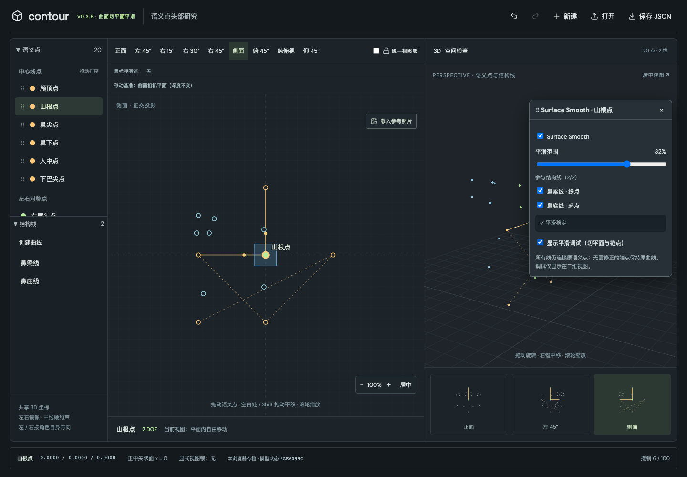
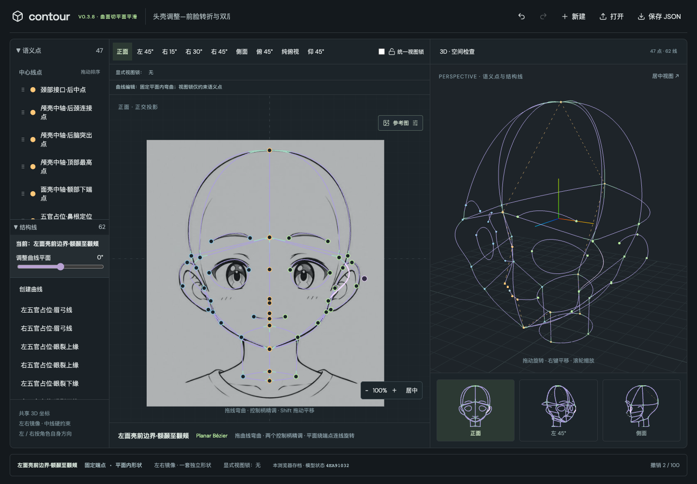

# V0.3.8 Surface Smooth Node

完成范围：Point + Planar Curve + Node-level Surface Smooth。没有 Surface/Patch/Mesh。

## Git 与修改文件

保险分支 `pre-v0.3.8-pairwise-smooth` 位于 `6ce6340`；实施分支为 `v0.3.8-surface-smooth-node`。保险提交保存完整旧版本及此前模型/参考图资产。

主要新增 `src/domain/surfaceSmooth/{model,config,solver}.ts`。集成涉及 Landmark model/persistence/presets/management、Curve management、store、CurveLayer、InspectView、JunctionInspector、session、样式和版本显示。测试更新位于 `src/tests/junctions.test.ts` 和 `tests/e2e/`。旧 junctions 的三个文件仅增加可选 legacy 字段防护，保留历史实现，不参与新几何求解。

## 持久化结构

```ts
surfaceSmoothDefaults: { enabled: true, extent: 0.15 }
surfaceSmoothNodes: Record<canonicalLandmarkUUID, {
  enabled?: boolean;
  extent?: number; // [0.01, 0.45]
  excludedHalfEdges?: { curveId: string; endpoint: 'start' | 'end' }[];
}>
```

没有 override 即继承默认。参与集合为 incident half-edges 减 exclusions，所以新增 Curve 自动参与。LEFT/RIGHT 共用 LEFT UUID 的配置，与选中点及 View Lock driver 无关。CENTERLINE exclusions 自动扩展为镜像 pair；删除清理 UUID，Rename 无影响，Duplicate 不复制 override。

旧 `smoothJunctions` 只在载入时读取：同一 canonical Node 的多个 extent 取最小值并限制合法范围；不迁移 pair selection、offset 或任何 resolved 几何。其余节点也默认 ON。新 JSON 不再输出旧字段。新自动保存键为 `contour.landmarks.v038`，首次读取可回退 v036，旧键保留。

## 求解

所有 Node 独立读取同一份 source cubic；按稳定 UUID 顺序累加单位外向端点切线的 `M = Σ ti tiᵀ`。固定迭代/选轴 Jacobi 解最小特征向量，没有 nonlinear/global optimizer。

重特征值时，先将 source normals 统一符号并求平均，投影到最小特征空间；不足时用固定世界轴。CENTERLINE 显式分离 X 与 YZ 子空间，重根也不会选混合 normal。镜像 Node 与 CENTERLINE 镜像 half-edge 的最终控制点均从 canonical 结果反射生成。

`q = normalize(m × n)`；选择与外向 source tangent 同向的符号。same-plane tolerance 为 `1e-12`，intersection stability tolerance 为 `1e-7`，中间区域明确 INVALID。两平面相同用原 tangent；`abs(dot(q,t)) < 1e-8` 的方向歧义明确拒绝，原因不是“没有共同平面”。

`angle(t,q) <= 1e-8 radians` 时保留 exact source 到 V，不构造 fairing。特别是两根非平行 tangent、已经共面的高 valence 节点不会因为开启 Smooth 强制改变形状。

## 局部 cubic 与双端

source arc-length 表使用 512 段确定性采样；`s = extent × min Li`，反查 source 参数得到 Pi。仅需修正时以 `D = |Pi-V|` 构造外向 cubic：

```
[V, V + q D/3, Pi - u(Pi) D/3, Pi]
```

end half-edge 再反向排列控制点。所有点仍在 source Plane 内，V 精确等于 Landmark position，Pi 与 exact source 在切线方向上连续。端点速度退化时尝试有限差分；Pi 处导数退化拒绝。

最终组合为 start fairing + de Casteljau exact middle + end fairing；无需修正的一端延伸 exact middle 到 V。两个 solver 不读取彼此的输出。extent 上限保证正常情况下至少约 10% source 弧长留在中间；另有双端 trim 参数检查，先收集所有冲突再原子回退，避免处理顺序依赖。

## 状态

- VALID/NORMAL：合法。
- VALID/HIGH_STRESS：当前以修正角大于 45° 提示；继续绘制，不因此判失败。
- INVALID：切线/交线不稳定、非有限构造、局部零导数、自交/局部段交叉或 trim overlap。整 Node 不提交任何 partial fairing，回退该端 source。另一端的独立有效 Smooth 可以保留。
- OFF / NO_OP：关闭或参与不足两条，不报求解失败。

source config 始终保留；source 恢复后重新求解。state/stress/reason/normal/Pi/控制点都不保存。校验 cubic 先按局部尺度归一化，避免 absolute threshold 使模型缩放改变判断。

## UI 与消费路径

右键或双击 Landmark 打开可拖动 Surface Smooth Node Inspector：ON/OFF、extent、所有 incident checkbox、状态、调试开关。CENTERLINE 镜像线合并 checkbox。INVALID 时 slider 仍可调整。extent 一次 pointer gesture 只记一步 Undo。

2D 主视图提供半透明切平面与 Pi 调试；这是 UI 状态，不进 history。本版没有 3D 调试 plane 或 tangent 箭头。

2D、缩略视图和 3D 统一消费新的 resolved spans。2D 使用 exact cubic SVG path；3D 使用现有离散显示。派生 span 拾取仍选原 Curve UUID，拖动调用原 source Curve 编辑，然后重新求解；没有派生控制柄。JSON 导出 source，不输出 preview。

## 验证

- `npm test`：93/93 通过，其中 31 项 Node Smooth 测试。
- `npm run test:e2e`：21/21 通过。
- `npm run build`：TypeScript + Vite 通过。
- 覆盖 valence 0/1/2/4、coplanar exact no-op、起止端方向、G1/planarity、重复 eigenvalues、镜像、exclusion、OFF、迁移、删除/复制/改名、失效恢复、双端 exact middle、1e-3/1e3 缩放、大角度 HIGH_STRESS。
- 实际耳廓/眼角项目完成迁移和 JSON 往返；原 Landmark 与 Curve source 无变化。
- 实际 refined head：47 点、62 曲线，36 VALID、11 NO_OP、4 HIGH_STRESS、0 INVALID，91 个 fairing spans。端点全部保留原 V，所有显示控制点有限。
- 浏览器测试验证派生 fairing 拾取修改原 Curve、Undo 恢复，Inspector toggle/exclusion/slider、失效恢复、真实下载与再载入。
- View Lock 零空间、driver/follower、受限拖动、reference transform、中心线排序与此前 UI 回归通过。相关数学未改。
- 首轮浏览器测试 19/20：旧中心线测试读错 v036 键；更新键后完整回归通过。另新增实际 fairing 编辑测试，最终总计 21。

## 界限

这是局部切平面语义，不保证未来填面的质量，也不强制两条边共 tangent。旧耳尖 pairwise rounded blend 不再保留，符合本次语义变更。

弧长为数值表；交叉与零导数检查为有限容差数值检查，不能视为任意曲线网络的全局拓扑证明。HIGH_STRESS 当前主要根据修正角提示，没有额外 curvature optimizer。3D 显示有采样误差，source 与 resolved cubic 不重拟合。

旧 pairwise solver 已退出 active imports；只复用 `junctions/spatial.ts` 中通用 Bézier 求值、细分与检查 helper，不调用旧五次构造/优化器。



