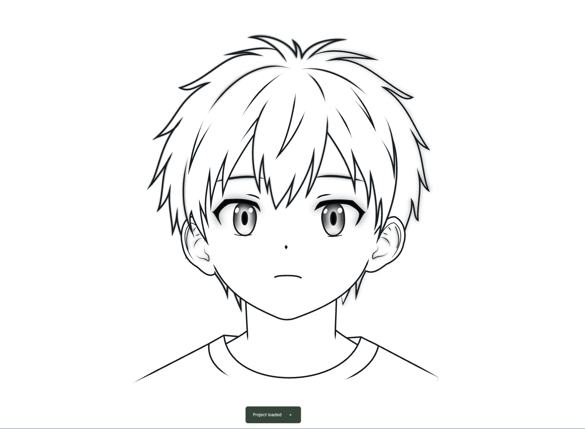

# 基础脸模 · 正面 · v1

[下载完整项目 JSON](基础脸模·正面·v1.json)

## 打开方式

使用 Contour V0.12.37 或兼容版本，先保存当前工程，进入「绘制间」，通过顶部「打开」选择 JSON。工程标题为「基础脸模·正面·v1」。预览图关闭了参考图；存档保留参考图及作者原有的显示状态。

此文件是完整项目存档。正式基础资产范围是其中的 Drawing Room；其余 HeadSet / Eyes / Recording 数据原样保留，不将其作为本次正面线稿资产的验收范围。

## 归档状态

- 来源：作者提供的 `基础脸模·正面·v1.json`，2026-09-25 归档。
- 作者已删除空下颌层及两个透明眼洞，调整了侧发和颈部相关几何。
- 本次整理只更改工程标题与 Drawing Room 的显示名称，包括图层、组织组、笔画、曲线段和填充。
- 节点与控制柄坐标、稳定 ID、接笔、联动、线宽、雾化参数、显示区间、深度偏移、对象顺序、背景图及时间戳均未改动。
- 18 个图层、46 条派生连续/闭合笔画、208 段曲线、230 个节点、23 个填充、135 个接笔关系、2 个组织组、4 个端点联动、17 条显示区间轨道。

## 命名约定

左右按角色自身定义；角色右侧位于正面画面的左边。

- 层名称表示内容：中央刘海、左右眼睑、左右眼内结构、面部底形、左右侧后发、颈部与衣领。
- 笔画名称表示用途：上睑墨形、下睑线、虹膜轮廓、瞳孔、高光、虹膜下缘柔光、耳廓外轮廓等。
- 连续笔画的一般成员使用「笔画名 · 段01」等名称。具有独立用途的成员保留语义名称，如左右下颌线、颈线、衣领后缘、面部上缘封口。
- 填充名称表示宿主与作用，例如「右虹膜轮廓 · 黑雾」「左虹膜下缘柔光 · 白雾」「面部外轮廓 · 白底」。
- 名称用于查找，关系仍由稳定 ID 引用；不依靠名字推断几何关系。

全部更名记录见 [naming-map.csv](naming-map.csv)。

## 应保留的遮挡语义

左右虹膜各四段轮廓保持父级深度 `+1`，在下缘白雾前显示；衣领后缘保持父级深度 `−1`，位于颈部底形之后。移动宿主或调整其兄弟顺序时，应检查对应遮挡结果。

白色填充属于对应的闭合边界，不要合并成公共填充层。高光与柔光的隐藏边界是有效几何，不是废弃线。

## 验证与适用范围

通过正常打开 JSON 验证，23 个填充边界有效。整理前后纯矢量渲染像素一致；保存后重新加载，渲染像素仍一致。文件摘要、计数和验证明细见 [verification.json](verification.json)。

本资产作为正面二维线稿基础版本。其他视角、表情、形变、换发型后的所有遮挡组合尚未作统一验收。
