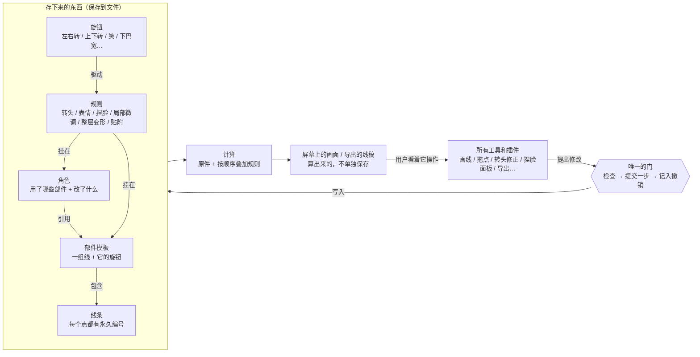

# 08 地基一页说明（给 bowen）

**晨间讨论稿**（2026-10-06 夜，Claude 起草，dot 审读了三轮）。**底座还没有选定**：方向已经定为 A；三条编辑器路线还没有完成比较，也没有任何结论经过实现验证。
这一页只回答四件事，不讲内部字段。

1. 工程里到底有哪些基本东西，它们是什么关系？
2. 所有工具怎样走同一套编辑、保存、撤销流程？
3. 转头、捏脸、曲边变形怎样接进来，而不用各自重写一套？
4. 哪些直接用现成方案，哪些必须自己做，为什么？

## 一张图



在不能显示上图的地方，文字版是这样：

```
 工具/插件 ──提出修改──▶ [唯一的门：检查 → 提交一步 → 记入撤销]
                                 │写入
                                 ▼
          存下来的东西：线条 ⊂ 部件模板 ◀─引用─ 角色
                       规则（挂在部件或角色上，由旋钮驱动）
                                 │
                                 ▼
              计算：原件 + 按固定顺序叠加规则
                                 │
                                 ▼
          屏幕画面 / 导出线稿（算出来的，不单独保存）
```

## 1. 基本东西和它们的关系

| 东西 | 是什么 | 关系 |
| --- | --- | --- |
| 线条 | 最小的画画单位。每个点都有永久编号，改名、挪位置都不变 | 属于某个部件 |
| 部件模板 | 一组线（比如“下巴”“左眼”），加上它自带的旋钮 | 原件，供角色引用 |
| 角色 | “用了哪些部件”加上“在原件上改了什么” | 引用部件。同一工程里的原件更新后，角色会跟上，但角色自己的局部修改按它当初声明的方式保留；外部库默认固定版本，要人手动升级 |
| 旋钮 | 左右转、上下转、笑、下巴宽……一个旋钮就是一个数值 | 驱动规则 |
| 规则 | 叠在原件上、每次计算都会重新套用的修改：转头、表情、捏脸、某个角度的微调、整层变形、“耳朵贴着下巴” | 挂在部件上（所有用到它的角色都会受影响）或挂在角色上（只影响这个角色） |
| 画面 | 原件加上按顺序叠加的规则，算出来的结果 | 不是工程的唯一原稿。可以缓存、可以导出，也可以明确转成一张独立的画稿继续精修 |

**旧概念的职责都保留，只是分清楚归属**（具体怎么存还没决定）：
- **快照**：同时承担了好几种职责，要分开：可以直接编辑的画稿、某个角度真实存在的关键形态、角度之间的过渡规则、收藏的视角（书签）、存档版本。
- **图层**：显隐、外观、上下顺序、变形作用到哪些线，这些职责都还在，而且都要有明确的归属。
- **录制**：拆成“角度形态和过渡规则”加上“计算它们的插件”，再加上“拖动时反推的工具”。

## 2. 同一套编辑、保存、撤销流程

所有工具都只能做一件事：**向门提出修改**。门负责：

1. **检查**：这次修改写到哪里（原件、某个角色、某条规则），在当前情况下能不能做到。做不到的部分要明确告诉用户，不能偷偷换成别的操作。
2. **提交**：一个手势提交成一步。拖动过程中只是预览，松手才真正写入；失败了什么也不留下。
3. **记入撤销**：全软件只有一条撤销历史，不分房间。撤销时画面回到那一步发生时的视角。
4. **重算**：只重算受这次修改影响的部分。

**保存**只写“存下来的东西”，不写画面。**导出**写的是算出来的画面。两者是不同的操作。

## 2½. 画布和工具的共同底座（dot 补充）

只有“一扇门”还不够，画布编辑器本身也要由底座统一保证三件事：

1. **选中的、拖动的、真正被修改的，是同一个东西**。底座要明确：这次写到哪一层、用的是哪个坐标空间。
2. **显示、点选、选中高亮、导出，用同一套几何和外观的解释**。编辑时可以看到、选中被隐藏的线，但这是一个明确的“编辑显示策略”，不是不同房间各算一套。
3. **复制、删掉原件、换模板、保存再打开之后，引用和局部修改的含义仍然明确**。对应不上时，能指出具体是哪里失效。

这些都由底座提供公共机制；转头、显隐区间、曲边变形只提供各自的计算方法和编辑含义。

**检验方法**：以后新增一种形变，不应该再去改一遍撤销、选择和保存，也不应该要求每个插件自己小心处理这些一致性。

## 3. 三个日常操作，从头走到尾

**A. 改模板里的下巴**
1. 打开“下巴”部件，拖动下巴尖。
2. 门检查：这次写的是**原件**。松手后提交一步。
3. 同一工程里用到这个下巴的角色都会重算。它们各自的局部修改（比如某个角色把下巴尖又拉长了一点）按当初声明的方式保留：是“跟着新下巴一起动”，还是“钉在原处”。

**B. 在 30° 拖动嘴角**
1. 把角色转到 30°，准备拖嘴角。
2. **先回答两个问题**，软件不替你偷偷选：
   - **改的是哪一份内容？** 原稿（所有角度都会变）、30° 这个角度的形态，还是 0°–90° 之间的过渡关系（可能连 90° 也跟着调，整段都会变）。
   - **影响谁？** 只影响这个角色，还是改共享的模板（所有用到它的角色都会变）。
   这两个问题是分开回答的，不是四选一。
3. 拖动时，**先预告影响范围**（例如“0°–90° 整段都会变化，90° 的嘴角会右移 3”），做不到的部分标红说明。
4. 松手提交一步。

**C. 撤销**
1. 按撤销，门把上一步原样退回。
2. 画面回到那一步发生时的视角（比如回到 30°）。
3. 无论上一步是在哪个房间、用哪个工具做的，都是同一条撤销历史。

## 4. 转头、捏脸、曲边变形怎样接进来

插件可以承担的职责，目前想到的有下面几种。**这不是已经证明完备的封闭清单**，后面可能还会补充：

| 插件可以提供 | 例子 |
| --- | --- |
| 新的规则种类 | “整层横向压扁一半”（曲边变形）、“耳朵贴着下巴” |
| 计算方法：把旋钮的值变成规则的效果 | 转头时，30° 介于 0° 和 90° 之间该怎么插值 |
| 编辑工具：把用户的拖动翻译成“向门提出修改” | 在 30° 拖动嘴角时，算出应该改哪条规则、改多少 |
| 面板和界面 | 捏脸滑块面板 |

无论哪种插件都**不能**：绕过门直接改数据、自带一套撤销、自带一套保存格式、自带一套选择逻辑。

所以：
- **转头** = 转头规则 + 插值计算方法 + 反推工具；
- **捏脸** = 捏脸旋钮 + 捏脸规则；
- **曲边变形** = 变形规则 + 它的计算方法。

三者共用同一扇门、同一条撤销历史、同一种保存方式。

## 5. 现成方案 vs 自己做

详细对比见 [07-tech-stack.md](07-tech-stack.md)。这里只说结论和还不确定的地方。

**编辑器怎么来，有三条路**（数据怎么存是另一个问题，单独比较）：
- **E1 在现成编辑器上扩展**（比如 tldraw）：选择、工具、画布、撤销都现成。代价是要把我们的模板、旋钮、规则塞进它的形状模型里，能不能塞得舒服**还没验证**；它的许可证需要你来判断能不能接受（正式上线需要授权密钥，免费版带水印）。
- **E2 借用能单独拿出来用的编辑器零件**：比如现成的选择、拖动控件这类画布零件，再加上数据零件；领域部分自己写。具体有哪些候选，dot 正在核对。
- **E3 全部用小零件自己拼**：自由度最大，工作量也最大。

**不管走哪条路**，模板 / 角色 / 规则、带收笔的描边、显隐区间、拖动反推这几块都得自己写，因为这是我们独有的东西。三条路的区别主要在“选择、工具、画布”这一块谁来出。

**今晚不下结论**。之后要做两件事：对 E1 做一次小规模试接；对 E2、E3 列出要自己写的编辑器部分的工作量清单。然后用同一批日常操作来比较。

**只借鉴做法、不用代码**：Blender、Figma、Live2D、Spine 等软件的设计。Live2D 和 Spine 的代码目前不嵌入，主要原因是技术不匹配：它们是播放各自模型的运行时，不是可编辑线稿的内核。授权条件另有说明，见 07。

## 6. 这一页还没有证明的事

- 三条编辑器路线（E1 / E2 / E3）哪条更省力、更稳：还没有比较过实际工作量。比较时必须把“画布和工具的共同底座”（§2½）算进工作量，不能只比较数据存储和规则引擎。

- 这套地基能否扛住 RC-01～20 的所有场景，目前只做到“设计上可以解释”，还没有用最小实现证明。
- 规则叠加的具体先后顺序（例如表情在转头之前还是之后）还没定。
- 性能（库很大时拖动是否流畅）要等最小实现来测。
