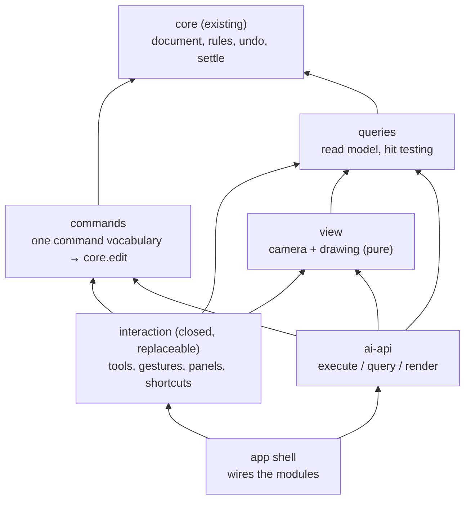
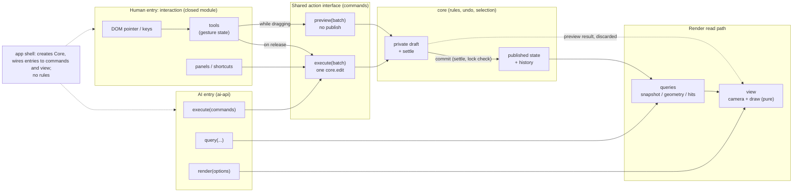

# 21 — Minimal drawing room: modules and design rules (draft for bowen's sign-off)

bowen 1791476705: build a minimal drawing room with two interfaces, one for AI and one for people. Its UI must be independent modules, and the drawing room is assembled from modules. **This file is the architecture and the rules; no code until bowen signs it off.**

## 0. Reframe (bowen 1791477975) — this section overrides the rest of the file for now

- **Parts that have a knowledge graph (the `core/v1` modules) must never be polluted.**
  - The drawing room uses only `core`'s public entry; `core` never imports it.
  - `core` is not changed for the drawing room's convenience. A gap the drawing room finds is a *finding*: it goes to bowen, then the graph, then `core`.
- **Everything else is a test bench:** page, canvas, tools, AI entry and glue.
  - It is built as simply and quickly as possible. Its only purpose is to test the graph modules and how they work together.
  - No generality, tidiness or corner cases. Each part gets its own graph and a rewrite later, one at a time.
  - It lives in `headset-core/bench/` with its own dependencies.
- **Parked until those parts get their own graph:** §2–§6c below. That covers the commands layer, `Core.preview`, structured refusals, explicit-target edits, the interaction and renderer contracts, the replacement tests and the ten entry principles.
- **Bench choices:**
  - React + SVG, the fastest to write.
  - Drag preview by undoing the previous step and editing again.
  - The AI entry is the `Core` object exposed on the page, plus a function that exports the current picture.
- **Bench scope:** what the current graph can test (§1 "In").

Base: the accepted `core/v1` (document model, editing and apply stage 1, at `0918892`). Interaction requirements: `docs/design/interaction-backlog.md` items 1–11.

**The two interfaces follow the version 2 decision** (`11-base-objects-and-layers.md` §6; bowen 1791476836: "the AI and human entries were already set in v2"). Version 1 is the original old version, version 2 the refactor, and this is version 3 (bowen 1791476857).

What carries over from v2 §6:
- **Named operations:** every change is a named operation. Mouse gestures and the API call the same operations, pass the same checks and write the same history (Blender `bpy.ops` with `poll()`; Figma plugins, where one run is one undo step).
- **The AI API** offers:
  - `inspect`: the tree, with a stable address, a semantic name and semantic tags for every object, plus the selection;
  - `find`: by name or tag; an ambiguous query returns every candidate; there is no guessing;
  - `apply(list)`: one undo step;
  - `preview(list)`: shows what would change, writing nothing;
  - errors with a code, the object addresses, a reason, optional fixes, and whether anything was written (never, on failure);
  - `diff(revA, revB)`;
  - `render(view, marked objects)`;
  - `explain(address)`, read-only.
- **Debug interfaces only read**; they never bypass the normal write path.
- **Links and locks apply alike to every entry.**
- **Acceptance in pairs:** the same operation by mouse and by API gives the same document, the same errors and the same undo.

**Scope rule (bowen 1791476920):** a feature whose principles are not settled in the v3 graph is not touched. Against v2 §6 this gives:
- **In:** named operations shared by both entries; `apply` (one undo step); `preview`; errors with a code, a message and the object addresses; `render`; `inspect` returning ids and the structure.
- **Not now (no v3 principles):** semantic names and tags (no `find`); `diff`; `explain`; save / load.
- Not doing semantic names does not hide what exists: layer names (new, rename) stay readable through `inspect` (dot).

## 1. Scope of the first drawing room

**In:**
- pen;
- A / V selection;
- move, rotate, scale and flip;
- split, bind, unbind, merge position;
- join tools (smooth, cusp, arc), end stroke, endpoint link;
- paint bucket (fill), with fill visibility;
- layer panel: new, rename, reorder, show / hide, lock, copy, delete;
- mirror apply and mirror link, with the axis shown;
- undo / redo.

**Out:**
- anything without settled principles in the v3 graph (bowen 1791476920), including save / load, semantic names and tags, `diff` and `explain`;
- domain deformation;
- copy / paste of selections;
- show / hide intervals;
- snapshots and recording;
- stroke rendering beyond a plain width (tapers come later).

## 2. Module map

Arrows point to what a module uses. Lower modules never import higher ones; a boundary test enforces this, as in `core`.

### 2.1 Call paths: two entries, one action interface, preview vs commit, render read (dot 1791476784)

- **Two entries, one action interface.**
  - People reach `commands` through the `interaction` module (tools, gestures and panels).
  - The AI reaches the same `commands.execute` directly.
  - Neither entry calls `core` itself.
- **The preview / commit boundary** is inside `commands`:
  - `preview` runs a batch on a private draft and discards it;
  - `execute` runs one `core.edit`, which settles, checks locks and publishes;
  - only `execute` adds an undo step.
- **The render read path** is the same for both: published state (or a preview result) → `queries` → `view`. `ai-api.render` uses the same `view`.
- **`app`** only creates the `Core`, connects entries to `commands` and `view`, and owns nothing else.

| Module | Owns | Does | Never does |
|---|---|---|---|
| `core` (exists) | the document, undo history, selection | every rule; one edit = one commit; refusals with codes | know about pixels, events or screens |
| `commands` | the command vocabulary: plain, serialisable objects such as `{ type: 'rotate', centre, angle }` | runs a batch of commands as one `core.edit`; returns `{ ok }` or `{ error: { code, message, targets } }`; a preview runs the batch without publishing (needs `core.preview`, §5) | decide anything a rule decides (it only maps commands to Editor calls) |
| `queries` | nothing | the read model for both interfaces: snapshot, geometry, bounds, **hit testing** (nearest point / handle / line, smallest loop) with a tolerance given by the caller | change anything |
| `interaction` (closed, replaceable) | all human-side state: active tool, gesture state, panel state, shortcuts | everything a person touches: DOM events → tools (pen, V, A, split, bind, link, joins, merge position, fill, mirror apply, mirror link) → preview batches while dragging, one command batch on release; Esc cancels; snapping previews only (backlog 4); toolbar, layer panel, properties; shows refusals (backlog 2, 6, 11); hands `view` an overlay description to draw | rules; any route to `core` except `commands` / `queries`; keeping its own copy of document data |
| `view` | the camera (pan / zoom) | defines the **overlay description** format in its public interface; builds a draw list from snapshot + geometry + overlay description; maps screen ↔ document; hands the draw list to the renderer | change state; import any interaction type (dot) |
| `renderer` (closed, replaceable; §6c) | nothing | draw list → pixels (screen, or an image for `ai-api.render`) | hit testing; tool or event code; change state |
| `ai-api` | nothing | `execute(commands)`, `query(...)`, `render(options) → image`; exposed for agents (e.g. on `window` for browser automation); same commands and error codes as people get | its own rules or shortcuts past `commands` |
| `app` | the one `Core` instance | wires modules, nothing else | logic |

## 3. Design rules

1. **Rules live only in `core`.** UI modules contain no domain checks ("is it locked", "can these bind"). They send commands and show what comes back: do not block, show consequences.
2. **One command vocabulary for people and AI.** Every human action ends as commands, and the AI sends the same commands. Acceptance (dot 1791476784):
   - the same action from the human entry and from the AI entry gives the identical document;
   - it gives the identical undo behaviour: same steps, same restored states;
   - replaying a human session's command log through `ai-api` reproduces the session.
3. **One gesture = one edit.** Tools preview during a drag and commit once on release; Esc cancels and nothing changes (graph "Edit (one gesture)").
4. **Views are pure.** Drawing reads state and never changes it. Display, hit testing and export use the same geometry (`core.geometry`).
5. **Refusals are data.** A refusal carries a code (`Locked`, `select-lines-to-delete`, `mirror-no-counterpart`, `topology-mismatch` and so on). `interaction` shows the matching mark; `ai-api` returns the same code.
6. **One selection.** The selection lives in `core` and is undoable. No module keeps its own copy.
7. **One coordinate rule.** Tools and commands work in document coordinates; only `view`'s camera knows screen pixels. Hit tolerance and snap radius are UI parameters given in pixels and converted by the camera; they are not core rules.
8. **Each module is independent.** One folder, one `index.ts`; imports only through it; dependency direction checked by a test; its own unit tests. Tools are tested with simulated pointer sequences, without a browser.
9. **The same process for every module:**
   - plan and acceptance list committed first;
   - undecided behaviour is listed and not implemented;
   - dot verifies before the next module.
10. **Mature choices first** for interaction details (shortcuts, A / V, marquee, handles), citing the tool they come from.

## 4. A gesture, end to end

1. pointer down → `interaction` (document coordinates from `view`'s camera).
2. While dragging: the tool builds a command batch → `commands.preview` → `view` draws the preview. Nothing is committed.
3. pointer up → `commands.execute(batch)` → one `core.edit`, which settles, checks locks and commits. The result is either a new snapshot or a refusal.
4. `view` redraws from the snapshot; a refusal shows its mark where it happened.
5. **Undo / redo use the same entry but a separate branch** (dot 1791477302): `commands.history('undo' | 'redo')` runs *outside* any edit transaction, because `core` forbids undo inside an edit. It is never mixed into a command batch. There is one history for both entries, undone in time order (the Figma-plugin precedent: a plugin run is a step the user can undo).

## 5. What `core` needs first (small, in its own modules)

- **`Core.preview(fn)`:** runs an edit on a private draft through settling *and the lock check*, and publishes nothing. It returns either the would-be snapshot and geometry, or exactly the refusal a commit would give.
  - **Fixed ids** (dot 1791477302; carried over from v2): repeated previews in one drag reuse the same new ids. Cancelling writes nothing. One gesture commits at most once.
  - **One actor at a time:** people and AI never operate at the same time (bowen 1791477364), taking turns on one document (dot 1791477408). So there is no concurrent merging, no handling of both sides writing at once, and no separate selections or histories.
  - **A preview expires on any change** (dot 1791477456): even with one actor, a preview can go stale, for example preview → undo, or preview → another command. Any committed edit, undo or redo invalidates every earlier preview. A preview returns a token, and committing *by that token* is refused with `preview-expired` once anything has changed. A plain `execute(batch)` (no token) simply runs on the current state. This is one change counter, not a version protocol.
  - **No late previews:** a preview runs synchronously, inside the pointer event that asked for it, so a result can never arrive after a later operation. If a preview ever becomes asynchronous, it carries its gesture's sequence number, and results from an older gesture are dropped (dot 1791477408).
- **Edits with explicit targets** (dot): today `Editor.transform` / `translate` / `rotate` / `scale` / `flip` act on the current selection. The entry rule (§6b) needs the same operations with the targets as an argument, reusing `editing`'s plan. `commands` must not fake it by selecting, transforming and restoring the selection.
- **Structured refusals** (dot 1791477302): today most refusals are plain `Error`s carrying a message. They must become `{ code, message, objects: ids, written: false }`. This is explicit interface work in `core`. No entry may parse message text to guess which object gets the red cross.
- **Change counter:** incremented by every committed edit, undo and redo. Used only so a preview can expire (dot 1791477456).
- ~~Export / import~~: not now; save / load has no v3 principles (bowen 1791476920).

## 6. Interaction backlog → module

| Backlog | Module |
|---|---|
| 1 helper for short handles | `view` + `interaction` |
| 2 red cross + lock on a lock refusal | `interaction` + `view` |
| 3 per-layer fill switch | `interaction` (layer panel) → `commands` |
| 4 snap only previews; bind on release | `interaction` |
| 5 paste offset | later (copy / paste is out of scope) |
| 6 delete-on-points hint | `interaction` + `view` |
| 7 drag feel | later (an add-on edit) |
| 8 scaling defaults | defaults in `commands`; `interaction` only fills them in |
| 9 mirror-link creation flow | `interaction` |
| 10 mirror icon, axis display | `interaction` + `view` |
| 11 mirror red cross | `interaction` + `view` |

## 6a. Interaction is one closed, replaceable module (bowen 1791477519)

Interaction has many scattered requirements but no unified principles yet. So it is built as **one closed module** whose inside may be rough for now. Later a principled interaction module replaces it **in one swap, losslessly**.

**The one principle for interaction at this stage (bowen 1791477615): interaction must not pollute any other module.** Everything below is how that is held:
- the contract;
- the boundary test;
- the rule that no meaning lives only in interaction;
- the contract tests.

What makes it replaceable:
- **A fixed contract**, the only things it may use or produce:
  - **in:**
    - DOM events from the canvas element and its panel area;
    - `queries` (read-only state, hit testing);
    - the camera from `view`;
  - **out:**
    - `commands` (execute, preview, history; nothing else writes);
    - an **overlay description**: plain data such as selection boxes, handles, the snap preview and refusal marks, which `view` draws;
    - its own panel DOM.
- **Nothing outside depends on its inside:** `core`, `commands`, `queries`, `view` and `ai-api` never import it. A boundary test enforces this.
- **No meaning lives only in it:** every choice that changes a result is a command parameter with its default in `commands` (§6b). So swapping interaction changes how things feel, never what a given command does to the document.
- **Contract tests**, which any interaction module must pass:
  - **fixed:** the interface and what an operation means. The same intent (for example "move this line to here") gives the same document and the same undo;
  - **not fixed:** shortcuts, gesture steps, panel layout and how hints look. Each version tests these with its own interaction tests; a scripted mouse sequence or overlay from the old module is never a shared test, or it would lock the next interaction principles in (dot 1791477618);
  - shared by every version: no route past the contract, cancel works, one commit per gesture, nothing left after unloading.
- **The AI entry does not go through it,** so the AI side is untouched by the swap.
- **It owns only transient state** (dot 1791477596): active tool, the step a drag has reached, the marquee, snap hints. Document data, the selection, links and the undo history stay in their own modules; interaction keeps no second copy.
- **One implementation is chosen in `app`.** Old and new follow the same contract, and a swap changes only that line. There is no plugin marketplace and no hot-loading framework.
- **"Lossless" means** the document and its history are never lost. A half-finished drag is not carried across versions: before a swap it is finished or cancelled, and then the old module's event listeners are removed.
- **The contract tests also cover cancelling:**
  - the same intent through the old and the new module gives the same document and the same undo;
  - a cancelled gesture leaves no preview behind and no half-applied change.

## 6b. Entry rules added after the attack (bowen 1791477114; Claude 1791477232; dot 1791477302)

- **Explicit targets:**
  - Every operation names the objects it acts on.
  - A human tool fills them in from the current selection. Changing the selection is a separate operation.
  - The selection itself stays single and undoable. Explicit targets only spare an operation from changing it first; there is no AI-private selection or history.
- **Result-affecting choices are parameters:** for example, whether a scale also scales arc radii, or what a snap resolved to. Their defaults live in `commands`, shared by both entries. Tools keep only pure interaction settings: snap radius in pixels, hit tolerance.
- **Same command, same behaviour:** paired acceptance compares the same targets, the same parameters and the same starting document, not button names.
- **One id allocator:** new ids come from `commands` (or from the caller, explicitly), the same for both entries. Repeated previews of one gesture reuse their ids.

## 6c. The renderer is one closed, replaceable module too (bowen, after 1791477652)

React draws the page frame and the panels; it is not what gets replaced. The drawing surface (SVG or Canvas 2D) is the **renderer**, a display-only module under the same principle: **it must not pollute any other module.**
- **In:** a draw list from `view` (curves, fills, overlay marks, all in screen coordinates). **Out:** pixels, on screen or as an image for `ai-api.render`.
- It holds no state, makes no hit tests, and knows no tools or events. Hit testing is `queries`' geometry, so it does not depend on what draws.
- Counter-example, v1 `src/ui/drawing/PaintScene.tsx:43-44`: the SVG drawing also renders transparent hit paths, lists tool names and handles `onPointerDown`. Drawing, hit testing and tools are tangled, so the renderer could not be swapped alone.
- Shared tests: the same draw list gives the same picture within a pixel tolerance; nothing outside imports it (boundary test).
- So SVG versus Canvas 2D becomes a choice of one module, reversible by a swap in `app`.

## 7. Open, for bowen

1. ~~How the AI interface is read~~: answered, it is the v2 decision (bowen 1791476836).
1b. ~~Semantic names and tags~~: not now; no v3 principles (bowen 1791476920).
2. **Stack for the human UI.** Proposal: TypeScript + Vite; React for the panels; Canvas 2D for the drawing and overlays; our own tool state machines, not Fabric. With Fabric, a second selection and transform state would compete with `core` (doc 07: one authority for authoring data).
3. ~~Save / load~~: not touched (bowen 1791476920).
