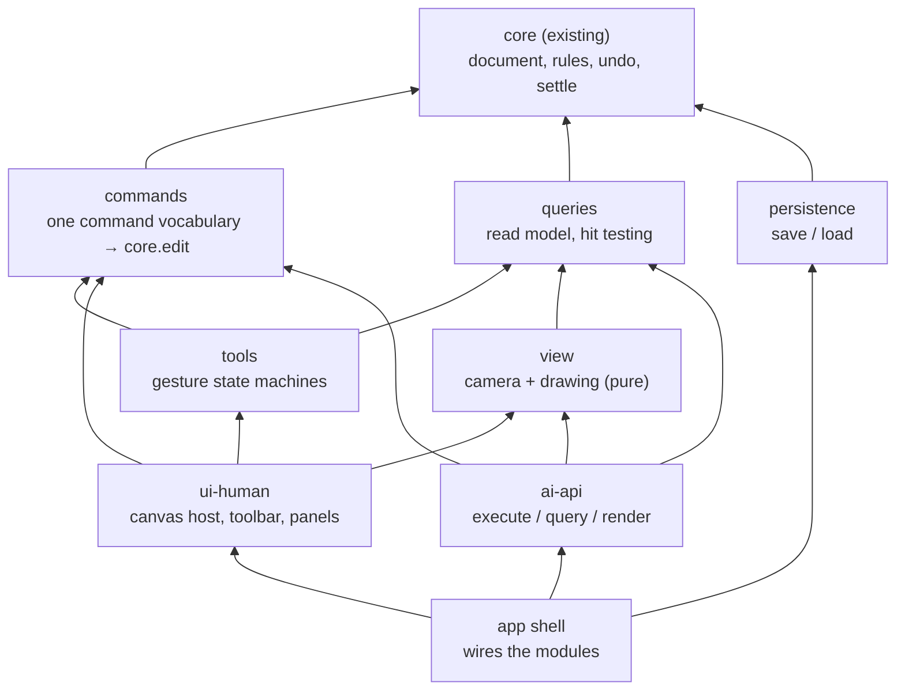

# 21 — Minimal drawing room: modules and design rules (draft for bowen's sign-off)

bowen 1791476705: build a minimal drawing room with two interfaces, one for AI and one for people. Its UI must be independent modules, and the drawing room is assembled from modules. **This file is the architecture and the rules; no code until bowen signs it off.**

Base: the accepted `core/v1` (document model, editing and apply stage 1, at `0918892`). Interaction requirements: `docs/design/interaction-backlog.md` items 1–11.

How "two interfaces" is read here (asked bowen 1791476749):
- **People:** canvas, toolbar, layer panel; mouse and keyboard.
- **AI:** a structured command and query interface, not a screen. Through it an agent draws, selects, transforms, applies, reads the document and gets a rendered image.

**Both go through one command layer**, so every rule is written once.

## 1. Scope of the first drawing room

**In:**
- pen;
- A / V selection;
- move, rotate, scale and flip;
- split, bind, unbind, merge position;
- join tools (smooth, cusp, arc), end stroke, endpoint link;
- paint bucket (fill), with fill visibility;
- layer panel: new, rename, reorder, show / hide, lock, copy, delete;
- mirror apply and mirror link, with the axis shown;
- undo / redo;
- save and load one document file.

**Out:**
- domain deformation;
- copy / paste of selections;
- show / hide intervals;
- snapshots and recording;
- stroke rendering beyond a plain width (tapers come later).

## 2. Module map

Arrows point to what a module uses. Lower modules never import higher ones; a boundary test enforces this, as in `core`.

| Module | Owns | Does | Never does |
|---|---|---|---|
| `core` (exists) | the document, undo history, selection | every rule; one edit = one commit; refusals with codes | know about pixels, events or screens |
| `commands` | the command vocabulary: plain, serialisable objects such as `{ type: 'rotate', centre, angle }` | runs a batch of commands as one `core.edit`; returns `{ ok }` or `{ error: { code, message, targets } }`; a preview runs the batch without publishing (needs `core.preview`, §5) | decide anything a rule decides (it only maps commands to Editor calls) |
| `queries` | nothing | the read model for both interfaces: snapshot, geometry, bounds, **hit testing** (nearest point / handle / line, smallest loop) with a tolerance given by the caller | change anything |
| `tools` | each tool's gesture state only | a state machine per tool (pen, V, A, split, bind, link, joins, merge position, fill, mirror apply, mirror link): pointer and keys in document coordinates → preview batches while dragging → one command batch on release; Esc cancels; snapping shows only in preview (backlog 4) | hold document data, or check rules itself |
| `view` | the camera (pan / zoom) | draws geometry and overlays (selection, handles, axis, preview, red cross with lock or mirror mark) from snapshot + geometry + tool overlay; maps screen ↔ document | change state |
| `persistence` | the file format | document → JSON → document (needs a core export / import, §5) | — |
| `ui-human` | panel state only (open panels, active tool) | turns DOM events into tool input; toolbar, layer panel, properties, shortcuts; shows refusals (backlog 2, 6, 11) | rules, geometry |
| `ai-api` | nothing | `execute(commands)`, `query(...)`, `render(options) → image`; exposed for agents (e.g. on `window` for browser automation); same commands and error codes as people get | its own rules or shortcuts past `commands` |
| `app` | the one `Core` instance | wires modules, nothing else | logic |

## 3. Design rules

1. **Rules live only in `core`.** UI modules contain no domain checks ("is it locked", "can these bind"). They send commands and show what comes back: do not block, show consequences.
2. **One command vocabulary for people and AI.** Every human action ends as commands. The AI sends the same commands. Test: replaying the command log of a human session through `ai-api` gives the identical document.
3. **One gesture = one edit.** Tools preview during a drag and commit once on release; Esc cancels and nothing changes (graph "Edit (one gesture)").
4. **Views are pure.** Drawing reads state and never changes it. Display, hit testing and export use the same geometry (`core.geometry`).
5. **Refusals are data.** A refusal carries a code (`Locked`, `select-lines-to-delete`, `mirror-no-counterpart`, `topology-mismatch` and so on). `ui-human` shows the matching mark; `ai-api` returns the same code.
6. **One selection.** The selection lives in `core` and is undoable. No module keeps its own copy.
7. **One coordinate rule.** Tools and commands work in document coordinates; only `view`'s camera knows screen pixels. Hit tolerance and snap radius are UI parameters given in pixels and converted by the camera; they are not core rules.
8. **Each module is independent.** One folder, one `index.ts`; imports only through it; dependency direction checked by a test; its own unit tests. Tools are tested with simulated pointer sequences, without a browser.
9. **The same process for every module:**
   - plan and acceptance list committed first;
   - undecided behaviour is listed and not implemented;
   - dot verifies before the next module.
10. **Mature choices first** for interaction details (shortcuts, A / V, marquee, handles), citing the tool they come from.

## 4. A gesture, end to end

1. pointer down → `ui-human` → `tools` (document coordinates from `view`'s camera).
2. While dragging: the tool builds a command batch → `commands.preview` → `view` draws the preview. Nothing is committed.
3. pointer up → `commands.execute(batch)` → one `core.edit`, which settles, checks locks and commits. The result is either a new snapshot or a refusal.
4. `view` redraws from the snapshot; a refusal shows its mark where it happened.
5. Undo is `commands.execute([{ type: 'undo' }])`, the same for AI.

## 5. What `core` needs first (small, in its own modules)

- **`Core.preview(fn)`:** runs an edit on a private draft through settling, returns the would-be snapshot and geometry, and publishes nothing. It is the same transaction machinery, with no commit.
- **Export / import:** the document state to JSON and back, with a version number. Undo history is not saved.

## 6. Interaction backlog → module

| Backlog | Module |
|---|---|
| 1 helper for short handles | `view` + `tools` (A) |
| 2 red cross + lock on a lock refusal | `ui-human` + `view` |
| 3 per-layer fill switch | `ui-human` (layer panel) → `commands` |
| 4 snap only previews; bind on release | `tools` |
| 5 paste offset | later (copy / paste is out of scope) |
| 6 delete-on-points hint | `ui-human` + `view` |
| 7 drag feel | later (an add-on edit) |
| 8 scaling defaults | `tools` (scale) |
| 9 mirror-link creation flow | `tools` (mirror link) |
| 10 mirror icon, axis display | `ui-human` + `view` |
| 11 mirror red cross | `ui-human` + `view` |

## 7. Open, for bowen

1. **How the AI interface is read** (asked 1791476749).
2. **Stack for the human UI.** Proposal: TypeScript + Vite; React for the panels; Canvas 2D for the drawing and overlays; our own tool state machines, not Fabric. With Fabric, a second selection and transform state would compete with `core` (doc 07: one authority for authoring data).
3. **Save / load in the first drawing room:** proposed in.
